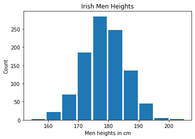
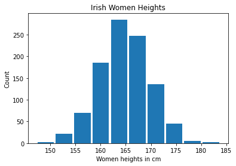
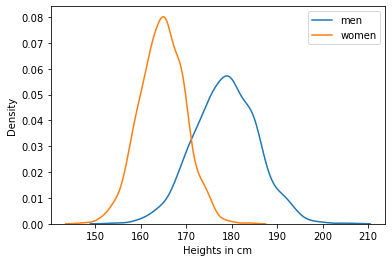
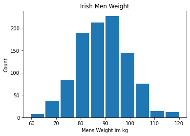
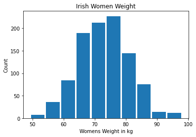
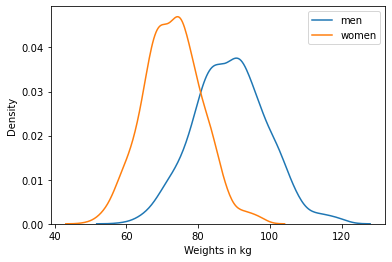
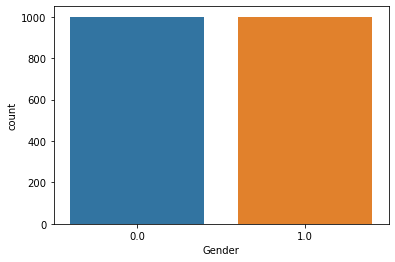
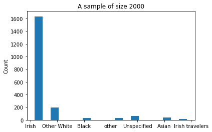
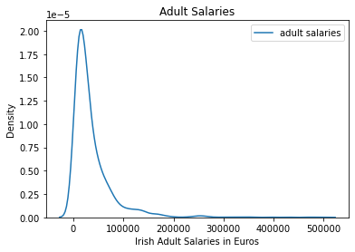
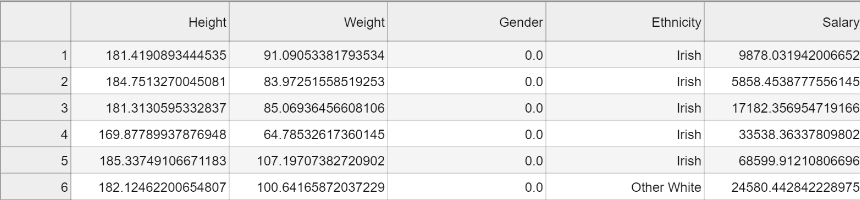

## **Yalini Brhanavan - GMIT - H.Dip Data Analytics**

* Programming for Data Analytics: Project 2020
* Dec 2020

---

## How to run the file
*  Python version 3.8 was downloaded via Anaconda Navigator 3 to Windows 10 OS (https://www.anaconda.com/).

*  Open Anaconda naviator and launch Juyptor Lab

* Open project folder, double click on the notebook FDAProject.ipynb. 

* Select *Kernel -> Restart Kernel and Run All Cells*  from top menu

## Project Introduction
* In this project,  I am simulating a sample 2000 Irish adult height, weight, gender and ethinicity. 

* The height of each gender is approximated by a normal distribution. 

* In reality, weights of men and women slightly deviate from the normal distribution. However, for simplicity I have assumed weight too can also represented by a normal distribtuion. 

* I have assumed the sample consists of equal numbers of males and females

* The distrivutuion of ethnicity reflects the measurements of the last census survey. 

## Simulating Variables

### 1. Height
According this [news article](https://www.thejournal.ie/height-irish-2899850-Jul2016/) the average height of an Irish man is 179cm and average heights of an Irish woman is 165cm.

I assumed the standard deviation of mens' heights in 7cm and womens' hieght has a standard deviation of 5cm. 

To simulate the height variable, first I generate a sample of 1000 men heights using the normal distribution function in Numpy. I set a seed value in the random number generator for reproducibility.  
<code> sample_heights_men = np.random.default_rng(seed=1).normal(loc=179, scale=7, size=1000) </code>  
  

Next, I generated a sample of 1000 women heights with mean 165 and standard deviation of 5cm.  
<code> sample_heights_women = np.random.default_rng(seed=1).normal(loc=165, scale=5, size=1000) </code>  
  

The chart below shows the  kernel density estimate plot (KDE plot) both men height and women height on the same chart.  
  

Finally I use Numpy's hstack function to concatenate the 1-D arrays mens heights and women heights into a single height varaible of size 2000.  
<code> heights = np.hstack((sample_heights_men, sample_heights_women)) </code>

### 2. Weight
According this [article](https://www.worlddata.info/average-bodyheight.php) the average weight of an Irish man 89.2 kg and average heights of an Irish woman is 73.1 kg. 

I assumed mens weight has a standard deviation of 10kg. Then I drew 1000 samples of men's weights from a normal distribution of mean 89.2kg standard deviation 10kg.  
<code> sample_weights_men = np.random.default_rng(seed=2).normal(loc=89.2, scale=10, size=1000) </code>  
 

Then I made an assumption women weight has a standard deviation of 8kg and drew another sample of 1000 weights using Numpy normal function.  
<code> sample_weights_women = np.random.default_rng(seed=2).normal(loc=73.1, scale=8, size=1000) </code>  
 

The chart below shows the  kernel density estimate plot (KDE plot) both men height and women height on the same chart.  
  

Finally I use Numpy's hstack function concatenate the 1-D arrays men weights and women weights into a single weight varaible of size 2000.  
<code> weights = np.hstack((sample_weights_men, sample_weights_women)) </code>

### 3. Gender
Becuase I drew 1000 samples of men and women for the variable height and weight. The gender variable simply has 1000 men and 100 women.  Here zeros denote men and 1 denotes women.  

<code> gender = np.hstack((np.zeros(1000), np.ones(1000))) </code>  
  

### 4. Ethnicity
According to the [2016 census data](https://www.cso.ie/en/releasesandpublications/ep/p-cp8iter/p8iter/p8e/) the ethnicity of Irish population is as follows : 
* Irish 82.2%  
* Other white 9.5%
* Asian 2.1% 
* other 1.5%, 
* black 1.4%
* Irish travelers 0.7%
* Unspecified 2.6%

In order to simulate the ethinicity variable first created a string array consisting of all the ethnicities in the population.  
<code> ethnic_group = np.array(['Irish','Irish travelers','Other White','Black','Asian','Unspecified','other']) </code> 

Then I create another variable named *prob* the representated the percentage of each group in the population.  

<code> percentage = np.array([0.822, 0.007, 0.095, 0.014, 0.021, 0.026, 0.015]) </code>  

Finally, I used Numpy's choice function to draw a sample of 2000 with replacement. This function  a random sample from using the *ethnic_group* variable with probabilities associated with each entry in *percentage*. Therefore the resulting sample represents the population.  
<code> ethinicity = np.random.default_rng(seed=0).choice(ethnic_group, 2000, p=percentage) </code>  
  

### 5. Salaries
Next I generated salaries for all the adults in the sample. According to [CSO the the median salary in 2018 was 36,095 Euros](https://www.cso.ie/en/releasesandpublications/ep/p-eaads/earningsanalysisusingadministrativedatasources2018/annualearnings/)  

Becuase salaries are tend to have a right skew and cannot be less than zero I used log normal distribution to simulate this variable.  

I assumed salaries are log-normally distributed with mean=10 and standard deviation=1. Here the mean and standard deviation are not the values for the distribution itself, but of the underlying normal distribution it is derived from.  

<code> salaries = np.random.default_rng(seed=5).lognormal(mean=10, sigma=1, size=2000) </code>  
  

As expected, the bulk of the salaries are between 0 and 100,000. The lowest salary was 825. The distribution has a long righ skew with the highest salary of 494,801.  

## Save the dataset as a csv file 
In this section I will save the 5 individual variables for height, weight, gender, ethnicity and salaries as a single csv file so it can be used by other scripts later.  

To do this, first I created a python dictionary with all 5 variables.  
<code> my_data_dict = {'Height': heights, 
                'Weight': weights, 
                'Gender' : gender, 
                'Ethnicity': ethinicity, 
                'Salary' : salaries} </code>

Then I used this dictionary to create a new pandas dataframe.  
<code> df_pda = pd.DataFrame(my_data_dict) </code>

The table below shows the first 10 rows of the dataframe.  
<code> df_pda.head(10) </code>  
  

Finally I saved the pandas dataframe as csv file to the current working directory.  
<code> df_pda.to_csv('dataset_pda2020.csv', index=False) </code>  
  

## REFERENCES 

